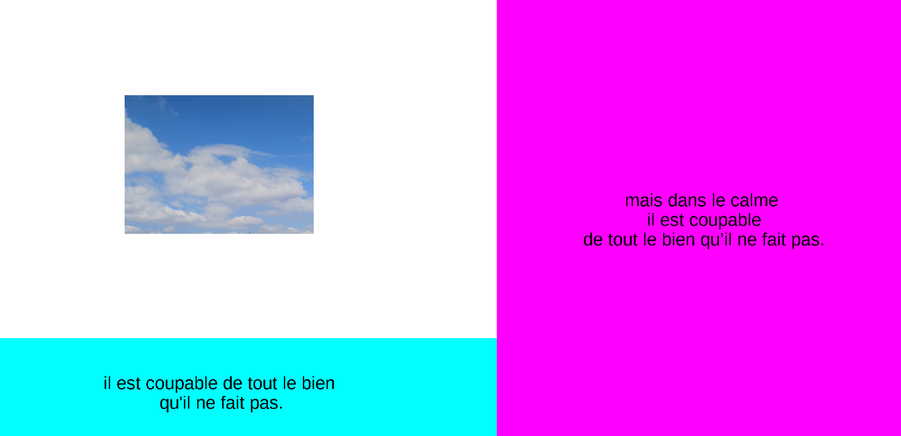

# simple_gui
Goal: design simple python GUI templates using tkinter
----

Will be adding different templates with screenshots

### Gui 1:

> python gui_1.py

Templates will be the basis of more advanced versions of previous projects. e.g.

- oxygen watchdog prototype (works-on-my-machine, not for clinical use (yet), built as an emergency solution when caring for a sick relative)
- custom deep researcher (project idea by kico)
- ocr + map for dog-walkers (project with daniel)
- semantic calendar (passive perception)
- custom ocr for reading forms

